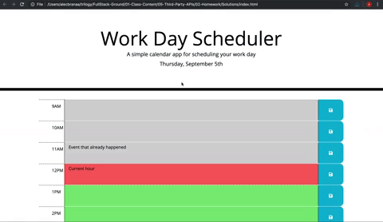

# Work Day Planner

Here is a calendar application that allows a user to save events for each hour of the day by modifying starter code. This app runs in the browser and feature dynamically updated HTML and CSS powered by jQuery. Also, here was used the [Moment.js](https://momentjs.com/) library to work with date and time. 

## User Story

```md
AS AN employee with a busy schedule
I WANT to add important events to a daily planner
SO THAT I can manage my time effectively
```

## Screenshots and mockups of the page


|| |
| --- | --- |
|  Work done | Mockup |

---


## Links to Review


* The URL of the deployed application: https://maryvpie.github.io/planner/

* The URL of the GitHub repository: https://github.com/MaryVPie/planner

- - -

